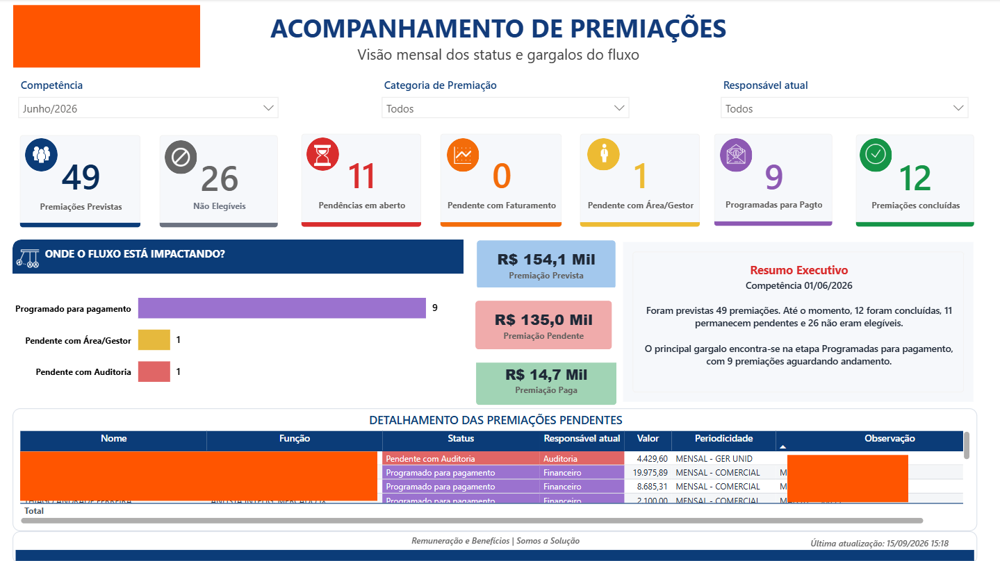
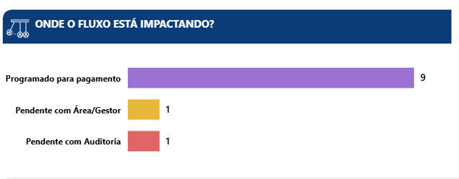
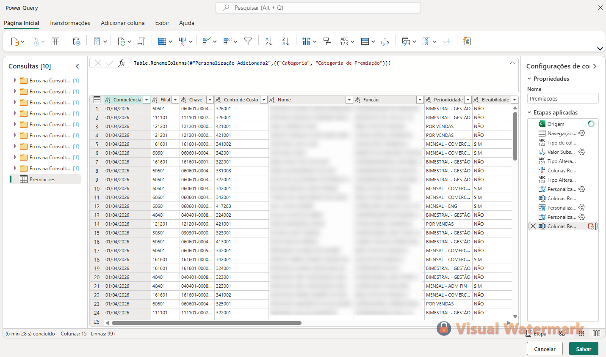
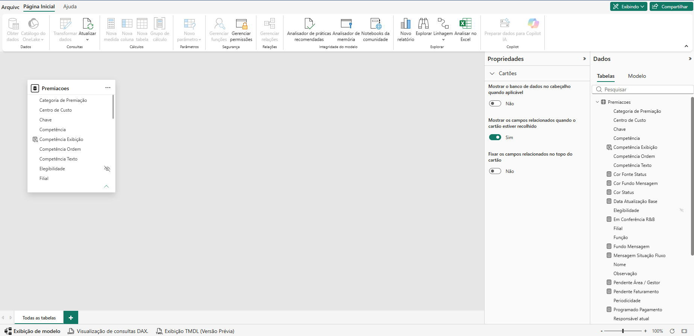
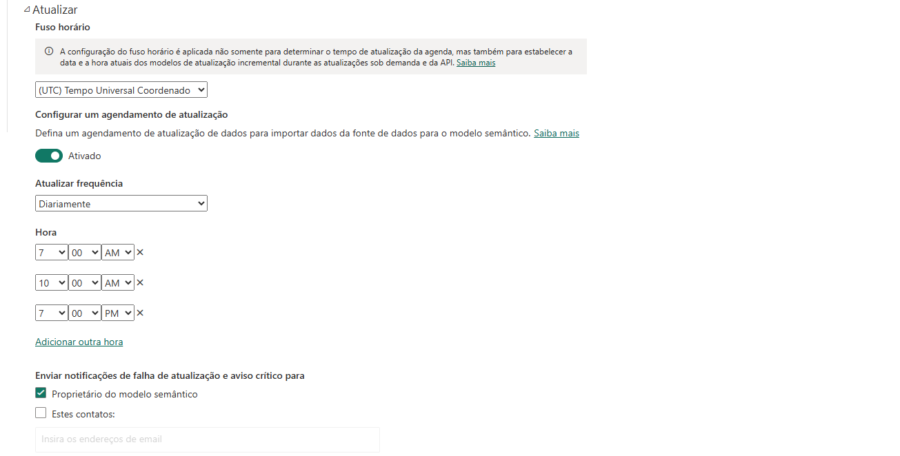

# Acompanhamento de Premiações

### People Analytics · Power BI · Remuneração & Benefícios

Case de People Analytics desenvolvido para transformar um acompanhamento operacional de premiações em uma **visão executiva orientada por dados**, ampliando a visibilidade sobre status, gargalos e andamento do processo.

<br>



<br>

## Visão geral

O projeto surgiu da necessidade de tornar o fluxo de premiações mais claro para acompanhamento gerencial.

O processo possui diferentes etapas, responsáveis e status, o que dificultava uma leitura rápida sobre:

- premiações previstas
- andamento do fluxo
- pendências em aberto
- principais gargalos
- responsáveis atuais
- premiações concluídas
- visão consolidada para acompanhamento executivo

A proposta foi transformar o controle operacional existente em uma solução de **Business Intelligence aplicada a um processo real de Recursos Humanos**.

---

## O desafio

A informação necessária para acompanhamento já existia, porém estava concentrada em controles operacionais.

Isso dificultava responder rapidamente questões como:

> Onde estão as principais pendências?

> Em qual etapa o fluxo está concentrado?

> Quantas premiações já foram concluídas?

> Qual é o status geral do processo?

> Onde é necessária atuação para que o fluxo avance?

O desafio não era apenas construir um dashboard.

Era necessário **estruturar os dados, traduzir regras de negócio e transformar informações operacionais em uma visão gerencial**.

---

## A solução

A solução foi construída a partir da base operacional de premiações, passando pelas etapas de tratamento, modelagem, desenvolvimento dos indicadores e publicação.

```text
Base operacional
      ↓
Power Query
      ↓
Tratamento e padronização
      ↓
Modelo de dados
      ↓
Indicadores e regras de negócio
      ↓
Power BI
      ↓
Power BI Service
      ↓
Atualização programada
      ↓
Visão executiva
```

O resultado foi uma visão capaz de consolidar o andamento das premiações e facilitar a identificação dos pontos que demandam acompanhamento.

---

## Gestão dos gargalos

Uma das necessidades centrais do projeto era identificar **onde o fluxo estava concentrando pendências**.



Essa leitura direciona o acompanhamento para as etapas que realmente exigem atenção, reduzindo a necessidade de analisar manualmente toda a base operacional.

---

## Preparação dos dados

O **Power Query** foi utilizado para realizar o tratamento e a padronização das informações antes da construção dos indicadores.

Entre as etapas trabalhadas:

- organização das colunas
- ajuste dos tipos de dados
- padronização das informações
- tratamento de campos
- preparação da estrutura necessária para análise



---

## Modelo de dados

Após o tratamento das informações, a base foi estruturada no Power BI para sustentar os indicadores e as regras utilizadas no dashboard.



Essa etapa permitiu organizar os campos, regras e medidas utilizados posteriormente nas análises e visualizações.

---

## Atualização automatizada

Após a publicação no **Power BI Service**, o modelo passou a contar com atualização programada.



A atualização automática reduz a dependência de intervenção manual no relatório e mantém a visão gerencial conectada à evolução da base operacional.

---

## Meu papel no projeto

Atuei de ponta a ponta na construção da solução:

- entendimento da necessidade de negócio
- tradução da demanda em indicadores
- estruturação da base operacional
- tratamento e preparação dos dados
- definição das regras de negócio
- construção dos indicadores
- desenvolvimento das visualizações
- organização da experiência de acompanhamento
- publicação no Power BI Service
- configuração da atualização programada

O projeto conecta conhecimentos de **Remuneração & Benefícios, People Analytics, processos e Business Intelligence**.

---

## Stack

`Power BI` · `Power Query` · `DAX` · `Excel` · `Power BI Service` · `Microsoft 365`

`People Analytics` · `Remuneração & Benefícios`

---

## Resultado

O acompanhamento de premiações passou a contar com uma camada gerencial capaz de consolidar informações e facilitar a identificação de gargalos, pendências e pontos de atuação.

> **De um controle operacional para uma visão executiva orientada por dados.**

O projeto demonstra como dados e tecnologia podem ser aplicados a processos de RH para gerar maior clareza, organização e suporte à tomada de decisão.

---

## Privacidade e confidencialidade

Este repositório possui finalidade exclusivamente profissional e demonstrativa.

As evidências foram selecionadas para apresentar a arquitetura e o desenvolvimento da solução sem disponibilizar bases de dados ou arquivos corporativos originais.

Informações pessoais, dados individuais e conteúdos sensíveis foram omitidos ou anonimizados.

---

## Portfólio

Este projeto faz parte do meu portfólio profissional, que reúne cases de **Remuneração & Benefícios, People Analytics, dados, automação e RH Tech**.

### [Acessar portfólio profissional](https://lroseno.github.io/)

---

## Contato

**Leonardo Roseno**

[LinkedIn](https://linkedin.com/in/leonardoroseno) · [Portfólio](https://lroseno.github.io/)
